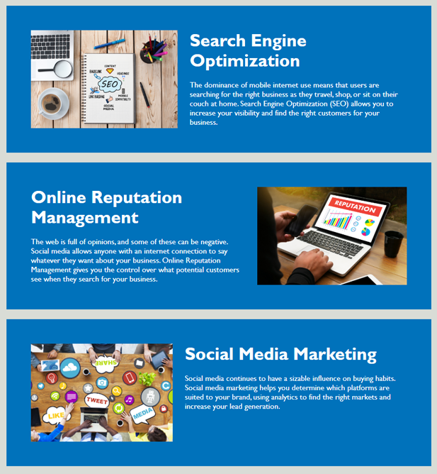

# Code Refactor Challenge

## Objective

Refactor code on Horiseon webpage so that it meets accessibility standards and is optimized for search engines. Make sure all links are functioning properly. Clean up and consolidate CSS selectors and properties. Organize structure of HTML by adding semantic elements and include comments before each element or section of the page.

## Review

- Deployed application: [https://rogerscl116.github.io/horiseon-homepage](https://rogerscl116.github.io/horiseon-homepage)   
- GitHub repository: [https://github.com/rogerscl116/horiseon-homepage](https://github.com/rogerscl116/horiseon-homepage)

## Semantic Elements

### Header

### Main

### Aside

### Footer

Created by *Charity Rogers*